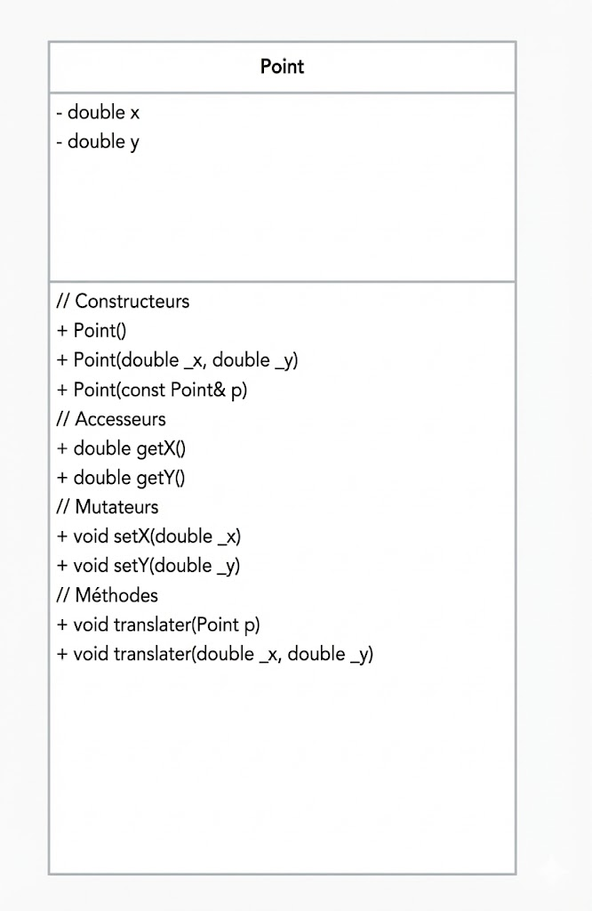
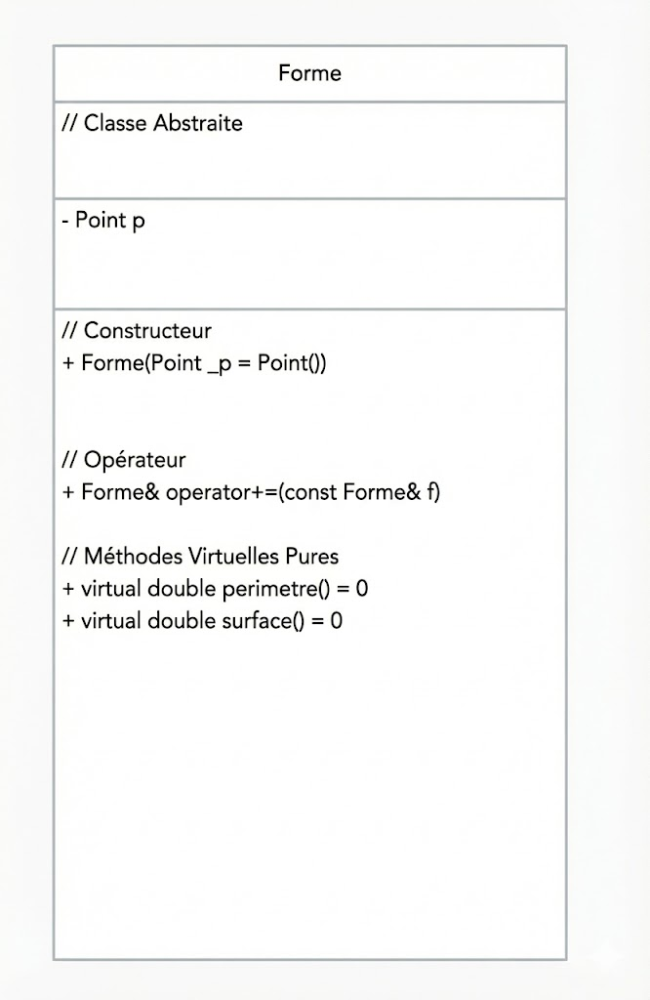
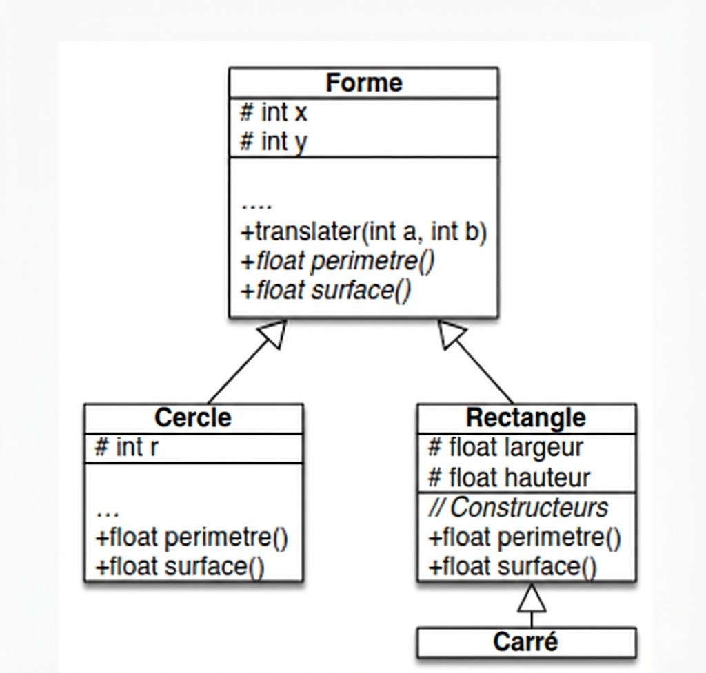

#### ECOLE CENTRALE DE NANTES

# RAPPORT SMP - TP7
## Formes Géométriques & Polymorphisme

**Date:** Février 2026
**Auteurs:** Nabil Khouani - Jonas Maouche

---

## Introduction

L’objectif de ce TP est de manipuler des classes, de travailler sur la surcharge d’opérateurs et de mettre en œuvre le polymorphisme en C++.

---

## 1. Création d'une Classe Point

### Question
Implémenter une classe `Point` représentant un point du plan (x, y) avec ses constructeurs (défaut, paramétré, recopie), une méthode de translation, ainsi que les accesseurs et mutateurs nécessaires.

**Diagramme de classes :**

<br><br><br>

### Spécifications
**Classe Point**
*   **Attributs :**
    *   `x` : Réel (Abscisse)
    *   `y` : Réel (Ordonnée)
*   **Constructeurs :**
    *   **Défaut :** Initialise `x` et `y` à 0.
    *   **Paramétré :**
        *   **Entrées :** Deux réels (`_x`, `_y`).
        *   **Rôle :** Initialise les attributs avec les valeurs fournies.
    *   **Recopie :**
        *   **Entrée :** Une référence constante vers un objet `Point`.
        *   **Rôle :** Copie les coordonnées du point source.
*   **Méthodes :**
    *   `translater(Point)` :
        *   **Entrée :** Un objet `Point`.
        *   **Rôle :** Ajoute les coordonnées du point passé en argument aux coordonnées courantes.
    *   `translater(réel, réel)` :
        *   **Entrées :** Deux réels (`_x`, `_y`).
        *   **Rôle :** Ajoute les valeurs fournies aux coordonnées courantes.
    *   `getX()`, `getY()` :
        *   **Sortie :** Réel (la valeur de la coordonnée).
    *   `setX(réel)`, `setY(réel)` :
        *   **Entrée :** Réel (nouvelle valeur).
        *   **Rôle :** Modifie la coordonnée correspondante.

---

## 2. Surcharge d'Opérateurs

### Question
Surcharger l’opérateur `<<` (pour l'affichage avec `cout`) et l’opérateur `+=` (pour la translation d'un point par un autre).

### Spécifications
*   **Opérateur `<<` (externe) :**
    *   **Entrées :** Un flux de sortie (`ostream`), un `Point` constant.
    *   **Sortie :** Une référence vers le flux de sortie (`ostream`).
    *   **Rôle :** Affiche les coordonnées du point dans le flux (format : "x: ... y: ...").
*   **Opérateur `+=` (membre) :**
    *   **Entrée :** Un objet `Point`.
    *   **Rôle :** Ajoute les coordonnées du point fourni au point courant (équivalent à `translater`).

---

## 3. Formes Géométriques Abstraites

### Question
Créer une classe abstraite `Forme` centrée sur un point, incluant la surcharge des opérateurs `+=` et `<<`, ainsi que les méthodes virtuelles pures `perimetre()` et `surface()`.

**Diagramme de classes :**

<br><br><br>

### Spécifications
**Classe Abstraite Forme**
*   **Attributs :**
    *   `p` : Objet de type `Point` (Centre de la forme).
*   **Constructeur :**
    *   **Rôle :** Initialise le point central (par défaut à l'origine).
*   **Opérateur `+=` :**
    *   **Entrée :** Un objet `Forme`.
    *   **Rôle :** Translate le centre de la forme courante en utilisant les coordonnées du centre de la forme passée en argument.
*   **Méthodes Virtuelles Pures (Abstraites) :**
    *   `perimetre()` :
        *   **Sortie :** Réel.
        *   **Rôle :** Renvoie le périmètre de la forme.
    *   `surface()` :
        *   **Sortie :** Réel.
        *   **Rôle :** Renvoie la surface de la forme.

---

## 4. Formes Géométriques Concrètes

### Question
Implémenter les classes concrètes `Cercle`, `Rectangle` et `Carré` (héritant de `Forme` ou `Rectangle`), en définissant les méthodes abstraites et en surchargeant l'opérateur `<<`.

**Diagramme de classes :**

<br><br><br>

### Spécifications
**Classe Cercle (hérite de Forme)**
*   **Attributs :**
    *   `r` : Entier (Rayon).
*   **Méthodes :**
    *   `perimetre()` : Retourne `2 * PI * r`.
    *   `surface()` : Retourne `PI * r * r`.

**Classe Rectangle (hérite de Forme)**
*   **Attributs :**
    *   `largeur`, `hauteur` : Réels.
*   **Méthodes :**
    *   `perimetre()` : Retourne `2 * (largeur + hauteur)`.
    *   `surface()` : Retourne `largeur * hauteur`.

**Classe Carré (hérite de Rectangle)**
*   **Rôle :** Représente un rectangle dont la largeur est égale à la hauteur.

---

## 5. Liste de Formes

### Question
Définir une classe `ListeFormes` utilisant un `vector` pour gérer une collection de formes, permettant le calcul de la surface totale et de la boîte englobante.

### Spécifications
**Classe ListeFormes**
*   **Structure de données :** `vector<Forme*>` (Liste de pointeurs vers des formes).
*   **Constructeur & Destructeur :**
    *   `ListeFormes()` : Initialise une liste vide.
    *   `~ListeFormes()` : Libère la mémoire des formes allouées dynamiquement.
*   **Méthodes :**
    *   `ajouter(Forme*)` :
        *   **Entrée :** Pointeur vers une forme.
        *   **Rôle :** Ajoute la forme à la liste.
    *   `surfaceTotale()` :
        *   **Sortie :** Réel.
        *   **Rôle :** Parcourt la liste et somme les résultats de la méthode `surface()` de chaque forme.
    *   `boiteEnglobante(double&, double&, double&, double&)` :
        *   **Entrées :** Références vers minX, maxX, minY, maxY.
        *   **Rôle :** Calcule les coordonnées min/max de l'ensemble des formes et met à jour les variables passées en référence.
    *   `getNbFormes()` :
        *   **Sortie :** Entier.
        *   **Rôle :** Retourne le nombre de formes dans la liste.

---

## 6. Bancs d'Essais

Les tests suivants ont été réalisés pour valider le bon fonctionnement de la classe `Point` et des surcharges d'opérateurs.

### Résultats d'exécution

```text
--- 1. Test Constructeur par defaut (p1) ---
x : 0
y : 0

--- 2. Test Constructeur parametre (p2) ---
x : 15.5
y : 20.5

--- 3. Test Constructeur de copie (p3 copie de p2) ---
x : 15.5
y : 20.5

--- 4. Test des Setters sur p1 ---
Modification de p1 vers (5.0, 5.0)...
x : 5
y : 5

--- 5. Test translater(double, double) sur p1 ---
x : 100
y : 200

--- 6. Test translater(Point) sur p1 ---
x : 15.5
y : 20.5
x: 15.5 y: 20.5

x: 31 y: 41


--- Test Rectangle ---
Position (0,0) | Rectangle, longueur: 10 hauteur: 5
Surface : 50

--- Test Carre ---
Position : (0, 0) | Carré, côté: 4
Surface : 16

--- Test Cercle ---
Position : (0, 0) | Cercle, rayon: 3
Surface : 28.26

--- Test Translater sur Rectangle ---
Rectangle avant translater :
Position (0,0) | Rectangle, longueur: 8 hauteur: 4
Rectangle après translater(10, 5) :
Position (10,5) | Rectangle, longueur: 8 hauteur: 4

--- Test Translater sur Carre ---
Carré avant translater :
Position : (0, 0) | Carré, côté: 3
Carré après translater(7, 2) :
Position : (7, 2) | Carré, côté: 3

--- Test Translater sur Cercle ---
Cercle avant translater :
Position : (0, 0) | Cercle, rayon: 5
Cercle après translater(Point(15, 10)) :
Position : (15, 10) | Cercle, rayon: 5

--- Test ListeFormes ---
Ajout de r2, k2, c2 a la liste...
Nombre de formes : 3
Surface totale de la liste : 119.5
Boite englobante : 
Min X : 5.5 Max X : 20
Min Y : 0.5 Max Y : 15
```

Ces résultats confirment que :
1.  L'initialisation des points (par défaut, paramétrée, par copie) fonctionne correctement.
2.  Les setters modifient bien l'état de l'objet.
3.  La méthode `translater` fonctionne avec des coordonnées explicites et avec un objet `Point`.
4.  Les opérateurs `<<` et `+=` ont le comportement attendu (surcharge correcte).
5.  **Validation de la classe ListeFormes :**
    * **Collection hétérogène :** La classe gère correctement l'ajout de différents types (Rectangle, Carré, Cercle) dans un `vector<Forme*>`.
    * **Polymorphisme :** La surface totale (119.5) prouve que le programme utilise la liaison dynamique pour appeler la bonne méthode `surface()` de chaque objet.
    * **Algorithme :** La boîte englobante est correctement calculée en parcourant toute la liste pour trouver les extrêmes (Min/Max).
    * **Mémoire :** L'exécution se termine proprement, validant le destructeur et la libération de la mémoire.
